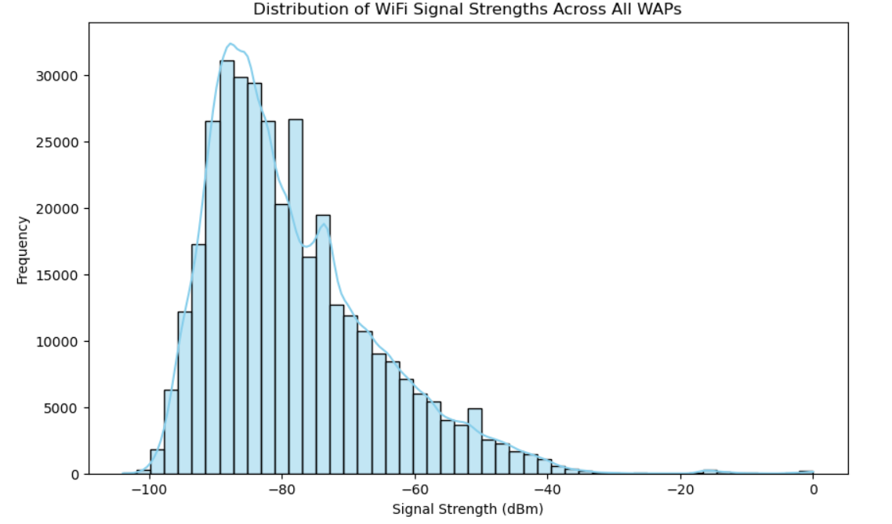
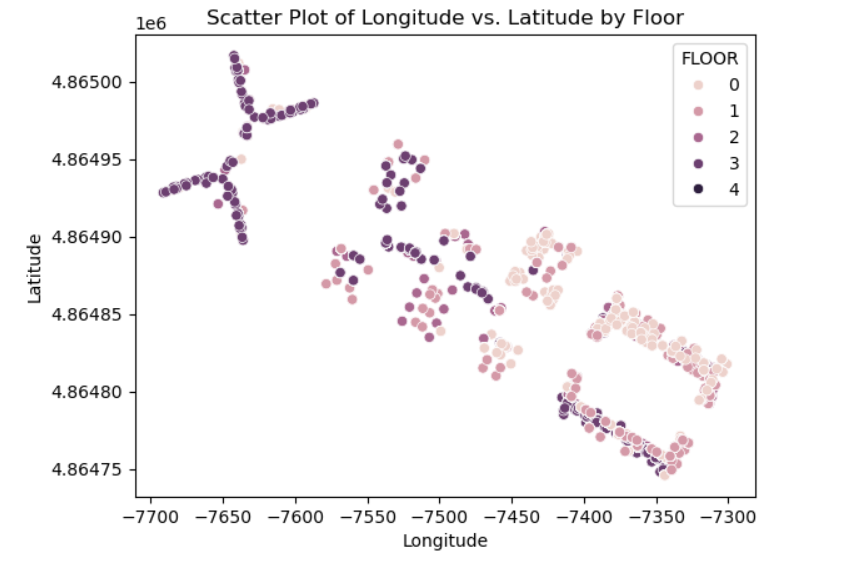
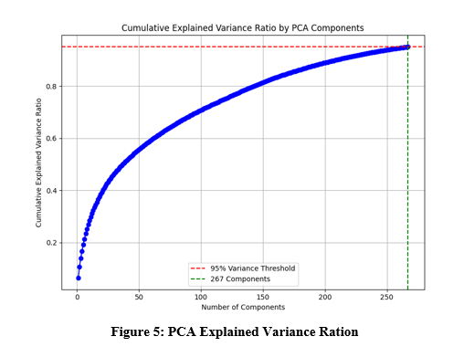

# Indoor Positioning Using Wi-Fi Fingerprinting

A machine learning approach to **indoor localization** using Wi-Fi fingerprinting.  
This project applies **Exploratory Data Analysis (EDA)**, **dimensionality reduction (PCA)**, and **machine learning models** (classification & regression) to predict indoor positions with high accuracy.

---

## 📊 Dataset
- **Source**: [UJIIndoorLoc Dataset](https://archive.ics.uci.edu/ml/datasets/UJIIndoorLoc)  
- **Records**: 19,937  
- **Features**: 529 (520 Wi-Fi signal features + spatial, user, temporal data)  

---

## 🔬 Methods
### Data Preprocessing
- Signal normalization  
- Removal of inactive WAPs  
- **PCA** → reduced to 267 components (95% variance retained)  

### Models
**Regression (Coordinates):**
- KNN (best RMSE ~15)  
- MLP (higher RMSE ~22)  

**Classification (Building & Floor):**
- Decision Tree (Building: 98.7%, Floor: 75.4%)  
- CNN (Building: 99.8%, Floor: 99.1%)  

---

## 📈 Results
- **CNN** → Best classification (>99% accuracy)  
- **KNN** → Best regression (RMSE ~15 units)  
- **Integrated System**: CNN (Building + Floor) + KNN (Coordinates)  

---

